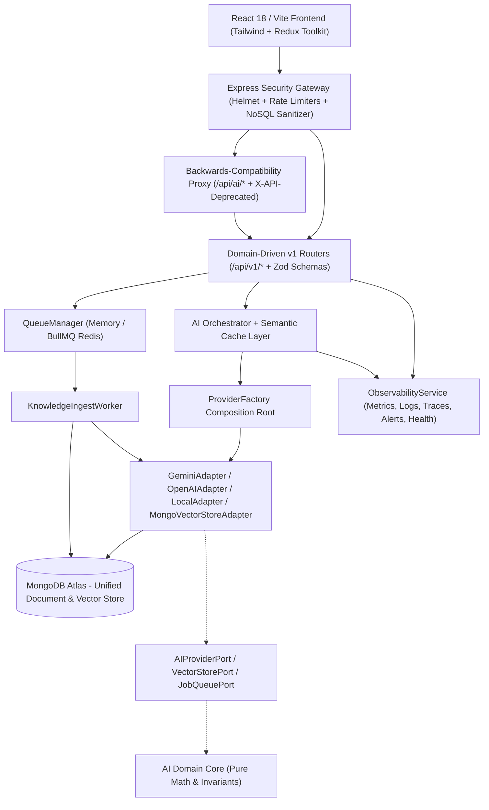

# AI Knowledge & Content Operating System for Technical Teams
## Comprehensive Developer & Architectural Documentation (v3.2.5)

---

### Table of Contents
1. [System Architecture Overview](#1-system-architecture-overview)
2. [Folder Structure Overview](#2-folder-structure-overview)
3. [Configuration & Environment Management](#3-configuration--environment-management)
4. [Backend API Reference & Versioning](#4-backend-api-reference--versioning)
5. [AI Subsystem Architecture (Hexagonal Ports & Adapters)](#5-ai-subsystem-architecture-hexagonal-ports--adapters)
6. [Hybrid RAG & Vector Knowledge Engine](#6-hybrid-rag--vector-knowledge-engine)
7. [Background Queue Engine & DLQ Processing](#7-background-queue-engine--dlq-processing)
8. [Multi-Layer Observability & Telemetry Engine](#8-multi-layer-observability--telemetry-engine)
9. [Frontend Architecture & State Management](#9-frontend-architecture--state-management)
10. [Testing Suite & Architectural Fitness Verification](#10-testing-suite--architectural-fitness-verification)
11. [Deployment & CI/CD Pipeline](#11-deployment--cicd-pipeline)
12. [Troubleshooting Guide & Common Scenarios](#12-troubleshooting-guide--common-scenarios)
13. [Future Roadmap & Version 3.3 Readiness](#13-future-roadmap--version-33-readiness)

---

### 1. System Architecture Overview

The **AI Knowledge & Content Operating System for Technical Teams** is an enterprise-grade platform designed to unify documentation, high-fidelity technical writing, automated research pipelines, and verifiable AI generation under a disciplined Hexagonal architecture.



---

### 2. Folder Structure Overview

```text
c:/BLOGG/
├── .github/workflows/ci.yml       # 4-stage automated CI/CD verification pipeline
├── docs/adr/                      # Architecture Decision Records (ADR-001 through ADR-006)
├── e2e/                           # End-to-end specification suite
├── api/
│   ├── index.js                   # Main application entry point & middleware injector
│   ├── package.json               # Backend dependencies
│   ├── src/
│   │   ├── ai/
│   │   │   ├── domain/            # Pure business logic entities (zero external imports)
│   │   │   ├── ports/             # Hexagonal interfaces (AIProviderPort, VectorStorePort, JobQueuePort)
│   │   │   ├── adapters/          # Concrete implementations (GeminiAdapter, MongoVectorStoreAdapter)
│   │   │   ├── plugins/           # AIPluginInterface & PluginManager registry
│   │   │   ├── orchestrator/      # Multi-provider routing & semantic caching orchestrator
│   │   │   └── cache/             # Semantic vector dot-product caching service
│   │   ├── config/profiles/       # ProfileManager (`development`, `testing`, `staging`, `production`)
│   │   ├── container/             # ProviderFactory dependency container
│   │   ├── docs/                  # OpenAPI 3.0 specification & Swagger UI generator
│   │   ├── middlewares/           # Security, Observability, and Global Error handlers
│   │   ├── models/                # Mongoose collections (Post, User, AiWorkflow, KnowledgeChunk, etc.)
│   │   ├── routes/
│   │   │   ├── v1/                # Versioned domain routers (/ai, /knowledge, /workflows, /health)
│   │   │   └── *.route.js         # Legacy unversioned route wrappers
│   │   ├── schemas/v1/            # Zod runtime verification contracts
│   │   ├── services/
│   │   │   ├── flags/             # FeatureFlagService (env + DB overrides + targeting)
│   │   │   ├── queue/             # JobQueueProvider, MemoryQueueProvider, BullMQQueueProvider, workers/
│   │   │   ├── observability/     # 5-Pillar ObservabilityService
│   │   │   └── cron/              # RetentionService for automated TTL cleanup
│   │   └── utils/                 # Strict env.validator.js & response.envelope.js
├── client/                        # React 18 / Vite single-page application
└── DEVELOPER_DOCUMENTATION.md     # This comprehensive guide
```

---

### 3. Configuration & Environment Management

All configuration is strictly governed by `env.validator.js` at server startup using Zod. If critical keys like `MONGO` or `JWT_SECRET` are missing, the process terminates immediately with actionable console error formatting.

#### Deployment Profiles (`ProfileManager`)
Set `DEPLOYMENT_PROFILE` or `NODE_ENV` to automatically load isolated operational parameters:
- `development`: Verbose logging (`debug`), in-memory queues, 5-minute cache TTL.
- `testing`: Deterministic mock adapters, zero cache (`enabled: false`), fast failure thresholds (`maxRetries: 0`).
- `staging`: Mirrors production with all experimental flags (`workflowStudio`, `experimentalModels`) enabled for dogfooding.
- `production`: Strict high-availability (`bullmq` Redis queue, 24-hour cache TTL, experimental features disabled).

---

### 4. Backend API Reference & Versioning

All endpoints return predictable, standardized response envelopes (`response.envelope.js`).

#### Success Envelope (`200 OK`, `202 Accepted`)
```json
{
  "success": true,
  "requestId": "9b1deb4d-3b7d-4bad-9bdd-2b0d7b3dcb6d",
  "data": {
    "output": "Hexagonal architecture decouples domain core from infrastructure...",
    "model": "gemini-1.5-flash",
    "provider": "gemini",
    "tokensIn": 420,
    "tokensOut": 185,
    "latencyMs": 312,
    "costUsd": 0.000087
  },
  "meta": {
    "timestamp": "2026-07-15T12:00:00.000Z",
    "version": "v1"
  }
}
```

#### Error Envelope (`400 Bad Request`, `429 Too Many Requests`, `500 Internal Server Error`)
```json
{
  "success": false,
  "requestId": "9b1deb4d-3b7d-4bad-9bdd-2b0d7b3dcb6d",
  "error": {
    "code": "VALIDATION_ERROR",
    "message": "Request validation failed.",
    "details": {
      "issues": [
        { "path": "prompt", "message": "prompt must contain at least 3 characters" }
      ]
    }
  }
}
```

---

### 5. AI Subsystem Architecture (Hexagonal Ports & Adapters)

To prevent architectural drift, the AI engine strictly follows concentric dependency rings:

```text
[Controllers & Routers]
         ↓  (requests dependency via ProviderFactory container)
[ProviderFactory / Orchestrator]
         ↓  (invokes interface methods on ports)
[AIProviderPort / VectorStorePort]
         ↑  (implemented by concrete adapters)
[GeminiAdapter / OpenAIAdapter / MongoVectorStoreAdapter]
```

- **Domain (`api/src/ai/domain/`)**: Pure entities (`AIRequestDomain`) computing costs and validating prompts with zero external library imports.
- **Ports (`api/src/ai/ports/`)**: Interfaces (`AIProviderPort`, `VectorStorePort`) establishing exact contracts.
- **Adapters (`api/src/ai/adapters/`)**: Classes connecting ports to actual SDKs or databases (`GeminiAdapter`, `MongoVectorStoreAdapter`).

---

### 6. Hybrid RAG & Vector Knowledge Engine

The Knowledge Intelligence layer (`/api/v1/knowledge`) supports real-time semantic anchoring:
1. **Ingestion**: Documents (`/ingest`) are chunked using sliding windows (`250` words with `35` word overlap).
2. **Embedding**: Each chunk receives a 64-dimensional semantic embedding via `embeddingService`.
3. **Indexing**: `MongoVectorStoreAdapter.storeChunks()` saves vectors and rich metadata (`heading`, `keywords`, `checksum`) in MongoDB `KnowledgeChunk` collection.
4. **Retrieval**: Exact cosine similarity dot-product matching filters (`s >= 0.35`) and ranks chunks, injecting them as citation anchors into prompt system instructions (`[Source 1: title - L12]`).

---

### 7. Background Queue Engine & DLQ Processing

Long-running tasks are offloaded to `QueueManager` resolving either `MemoryQueueProvider` or `BullMQQueueProvider` (`Redis`):
- **Worker Registration**: `registerKnowledgeWorker()` registers `knowledgeIngestHandler` listening to `knowledge-ingest`.
- **Automatic Retries**: Failed jobs undergo exponential backoff (`delay * 2^(retryCount-1)`) up to `maxRetries: 3`.
- **Dead Letter Queue (DLQ)**: Jobs failing all attempts transition to the DLQ (`/api/v1/jobs/dlq`), where developers can inspect diagnostics and trigger manual re-processing (`POST /api/v1/jobs/:jobId/retry`).

---

### 8. Multi-Layer Observability & Telemetry Engine

`ObservabilityService` divides telemetry into 5 independent pillars:
1. **Metrics**: In-memory tracking of counters (`http_requests_total`), gauges (`memoryUsageMb`), and percentiles (`p50`, `p95`, `p99` latency).
2. **Logs**: Structured JSON logs (`log('info', message, meta)`) correlated by `requestId`.
3. **Traces**: Request duration spans initiated by `observabilityMiddleware` (`req.traceSpan`).
4. **Health**: Comprehensive probes (`/api/v1/health`) diagnosing MongoDB readyState, queue worker status, vector store connectivity, and plugin registry counts.
5. **Alerts**: In-memory alert ring buffer capturing critical events (`triggerAlert('critical', title, details)`).

---

### 9. Frontend Architecture & State Management

The frontend (`client/src/`) is built on React 18, Vite, and Tailwind CSS, utilizing Redux Toolkit (`userSlice.js`) for global state, user session token management, and dark/light theme persistence.

---

### 10. Testing Suite & Architectural Fitness Verification

Run the comprehensive suite using standard Jest commands:
```bash
# Run strict Hexagonal boundary invariants test
npx jest api/__tests__/architecture/fitness.test.js

# Run domain and adapter unit tests
npx jest api/__tests__/unit/

# Run API integration tests
npx jest api/__tests__/integration/
```

---

### 11. Deployment & CI/CD Pipeline

The `.github/workflows/ci.yml` pipeline automates quality gates across 4 stages:
1. **Linting & Validation**: ESLint check across client/api and startup Zod validation verification.
2. **Test Suite**: Spins up a ephemeral MongoDB 7.0 Docker service to run all architectural fitness, unit, and integration tests.
3. **Build**: Compiles production Vite client bundle (`npm run build`).
4. **Security Scan**: Audits dependency tree against known CVEs (`npm audit`).

---

### 12. Troubleshooting Guide & Common Scenarios

| Scenario / Symptom | Root Cause | Immediate Action / Resolution |
| :--- | :--- | :--- |
| Server fails to start (`❌ MONGO environment variable is required`) | Missing `.env` secret or malformed connection string. | Verify `.env` contains `MONGO=mongodb+srv://...` and `JWT_SECRET` ($\ge 8$ chars). |
| `HTTP 429 Too Many Requests` on AI generation endpoints | Rate limit exceeded (`aiLimiter` restricts to 30 req/5min per IP). | Wait 5 minutes or switch `DEPLOYMENT_PROFILE=development` for local testing. |
| Background knowledge ingestion stuck in `'pending'` | Queue worker not registered or Redis disconnected when `bullmq` profile active. | Verify `registerKnowledgeWorker()` is called on startup; check `/api/v1/jobs/dlq` for errors. |
| Controllers reporting `forbidden concrete provider import` in CI | Architectural fitness test violation (direct import of `gemini.provider.js`). | Replace direct import with `providerFactory.getProvider('gemini')` in controller code. |

---

### 13. Future Roadmap & Version 3.3 Readiness

With Version 3.2.5 Engineering Stabilization and Version 3.2.6 Performance Optimization complete, the platform enters a **2–4 Week Dogfooding Phase** to establish production baseline metrics. Upon validation, **Version 3.3** will introduce:
- **Real-Time Collaboration Engine**: WebSockets (`socket.io`) for multi-user shared workflow editing and live article commenting.
- **Enterprise Team Billing & Role-Based Access Control (RBAC)**: Fine-grained permissions (`workspace:owner`, `editor`, `viewer`) and Stripe token usage metering.
