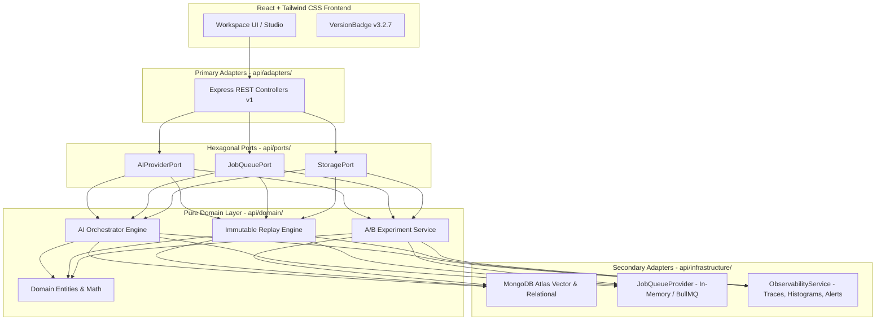

# Architecture Snapshot — Version 3.2.7 (Production Validation & Operational Readiness)

**Timestamp**: `2026-07-15`  
**Status**: `Frozen & Verified (19/19 Test Suites Passing)`  
**Paradigm**: `From Build to Operate`

---

## 1. High-Level Architectural Topology

---

## 2. Core Modules & Capabilities (V3.2.7)

1. **Hexagonal AST Boundary Enforcement (`fitness.test.js`)**:
   - Automated AST verification ensuring `domain/` and `ports/` never import `adapters/` or `infrastructure/`.
2. **Immutable AI Error Replay Engine (`/api/v1/ai/logs/:logId/replay`)**:
   - Captures exact `ExecutionSnapshot` (`request`, `systemPrompt`, `providerVersion`, `retrievedChunks`, `cacheStatus`, `evaluationResult`).
   - Non-destructive execution generating child logs (`isReplay: true, parentLogId`) and regression similarity diffs (`>= 0.65 threshold`).
3. **AI Experiment Framework (`/api/v1/ai/experiments`)**:
   - Live traffic routing (`trafficSplit: 0.5`) across Prompt/Provider `Variant A` vs `Variant B`.
   - Automated composite scoring (`60% quality + 30% success rate - 10% latency penalty`) to declare statistical winners.
4. **Production Validation Dashboard & 7 Readiness Gates (`/api/v1/ai/health-dashboard`)**:
   - Computes 30-day sliding trends across `P95/P99 latency`, `AI success rate (>=98%)`, `cache hit rate (>=25%)`, and `crash rate (<=0.5%)`.
   - Enforces quantitative gates (`Gate A` through `Gate G`) before authorizing version advances.
5. **Automated Release Pipeline (`scripts/release.js` & `scripts/rollback.sh`)**:
   - Semantic versioning, automated markdown `CHANGELOG.md` generator, and one-command staging/production rollback.
