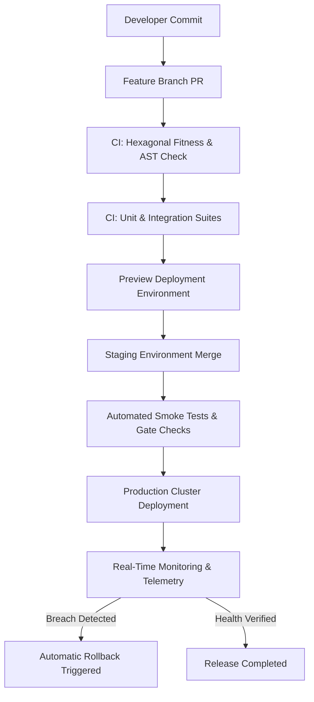

# Production Deployment Pipeline Architecture

To guarantee high availability, zero-downtime releases, and immediate failure mitigation, the AI Knowledge & Content Operating System employs a rigorous, automated continuous deployment workflow fronted by architectural boundary fitness verifications and smoke tests.

---

## Deployment Workflow Pipeline

---

## Pipeline Stage Breakdown

### 1. Developer Workstation (`Pre-Commit / Local Verification`)
- Developers verify changes locally against pre-commit hooks.
- **Commands**: `npm run lint`, `npx jest api/__tests__/architecture/fitness.test.js`.

### 2. Feature Branch Pull Request (`CI Boundary Check`)
- Every Pull Request triggers GitHub Actions Continuous Integration.
- **Enforcements**:
  - **Hexagonal Architecture Fitness (`fitness.test.js`)**: Verifies no forbidden cross-layer imports exist (`domain/` calling `adapters/` or external SDKs).
  - **Unit & Integration Suite**: All 19 test suites must execute and pass cleanly (`100% pass`).
  - **Lighthouse Performance Check**: Verifies frontend bundle stays under budgets (`JS <= 250KB`, `CSS <= 30KB`).

### 3. Preview Deployment Environment
- Ephemeral preview URL generated for UI/UX friction review and visual inspection before merging to main.

### 4. Staging Environment & Automated Smoke Tests
- Merges to `staging` trigger automated database index verification (`npm run migrate:check`) and comprehensive smoke tests against `GET /api/v1/health` and `GET /api/v1/ai/health-dashboard`.

### 5. Production Cluster Zero-Downtime Deployment
- Production deployment uses rolling restarts (`pm2 reload all` or container rolling updates) ensuring active connections finish gracefully before workers recycle.

### 6. Real-Time Monitoring & Automatic Rollback Interception
- For 15 minutes post-deployment, `observabilityService` monitors error rates and event loop lag.
- **Automatic Rollback Condition**: If `crashRate > 0.5%` or `eventLoopLagMs > 500ms` for more than 120 continuous seconds, the system executes `scripts/rollback.sh <previous_stable_tag>` automatically.
