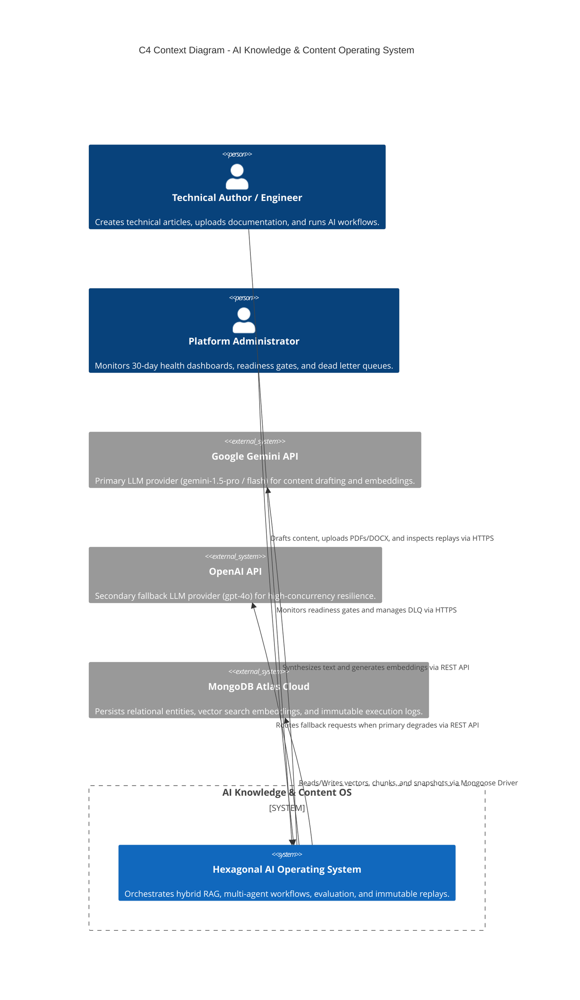
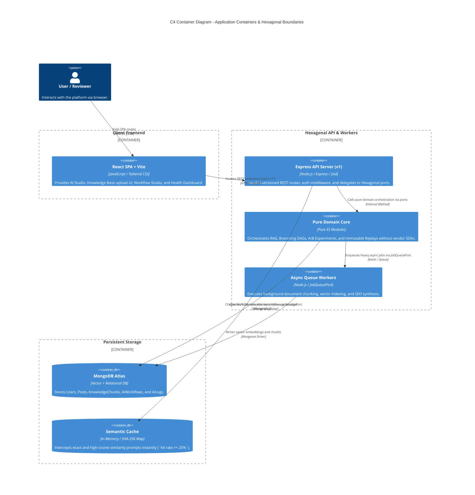
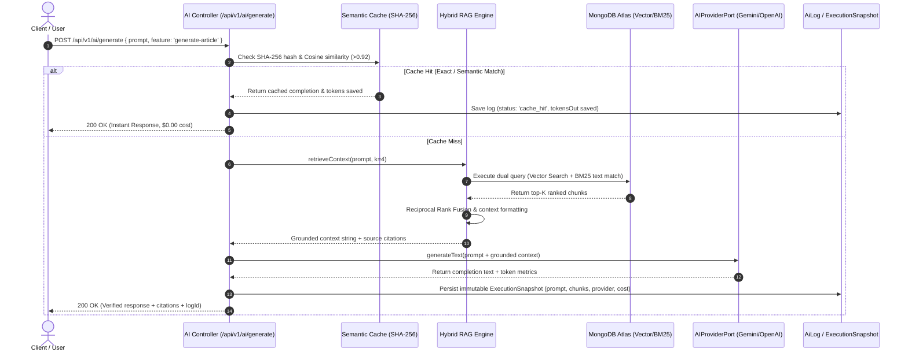
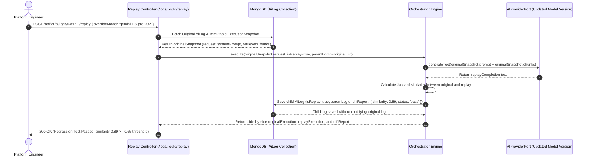
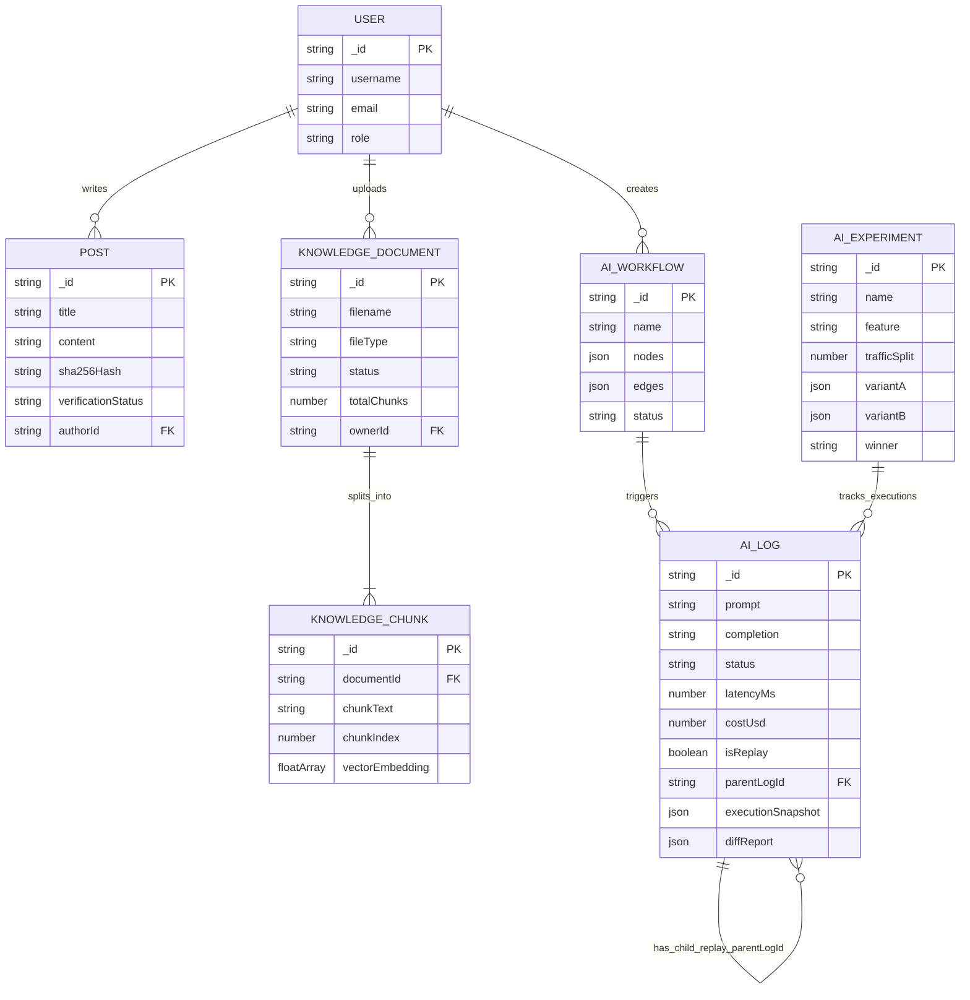

# Comprehensive C4 & System Architecture Diagrams

This document provides visual engineering evidence of our system boundaries, container interactions, domain ports/adapters, and data flows. Reviewers can evaluate the system architecture directly through these C4 Context, Container, Component, Sequence, and Deployment diagrams.

---

## 1. C4 Context Diagram (`Level 1: System Context`)

Shows the AI Knowledge & Content Operating System in context with external users and third-party AI/Database providers.



---

## 2. C4 Container Diagram (`Level 2: Container Boundaries`)

Shows the internal architectural containers across the SPA Frontend, Hexagonal API Server, Background Workers, and Storage layers.



---

## 3. C4 Component Diagram (`Level 3: Hexagonal API Components`)

Shows the exact internal breakdown of `api/` into `adapters/`, `ports/`, and `domain/`, providing visual proof of Hexagonal Architecture enforcement (`ADR-005`).

```mermaid
graph TB
    subgraph AdaptersLayer ["Primary Adapters (HTTP / CLI) - api/adapters/"]
        REST[Express v1 Controllers<br/>/api/v1/ai/*, /api/v1/health-dashboard]
        CLI[Automated Scripts<br/>release.js / rollback.sh]
    end

    subgraph PortsLayer ["Hexagonal Interface Ports - api/ports/"]
        AIPort[AIProviderPort<br/>generateText(), embedText()]
        QueuePort[JobQueuePort<br/>addJob(), getDLQStatus()]
        StoragePort[StoragePort<br/>saveLog(), getChunk()]
    end

    subgraph DomainLayer ["Pure Domain Orchestration - api/domain/ & api/ai/"]
        Orchestrator[Orchestrator Engine<br/>Multi-vendor fallback & caching]
        ReplayEngine[Immutable Replay Engine<br/>Non-destructive execution & diffing]
        ExperimentEngine[A/B Experiment Service<br/>Traffic split & composite scoring]
        RAGEngine[Hybrid RAG Engine<br/>Vector Cosine + BM25 Fusion]
        WorkflowEngine[Branching DAG Engine<br/>Node evaluation & error propagation]
    end

    subgraph SecondaryAdapters ["Secondary Adapters (Vendor / Infrastructure) - api/infrastructure/"]
        GeminiAdapter[GeminiProviderAdapter<br/>@google/genai SDK]
        OpenAIAdapter[OpenAIProviderAdapter<br/>openai SDK]
        MongoAdapter[MongoStorageAdapter<br/>Mongoose Models & Zod]
        QueueAdapter[JobQueueProvider<br/>In-Memory / BullMQ]
    end

    REST & CLI --> AIPort & QueuePort & StoragePort
    AIPort & QueuePort & StoragePort --> Orchestrator & ReplayEngine & ExperimentEngine & RAGEngine & WorkflowEngine
    Orchestrator --> AIPort
    ReplayEngine --> StoragePort & AIPort
    ExperimentEngine --> StoragePort
    RAGEngine --> StoragePort & AIPort
    WorkflowEngine --> QueuePort & StoragePort

    AIPort -.->|ProviderFactory| GeminiAdapter & OpenAIAdapter
    StoragePort -.->|Dependency Injection| MongoAdapter
    QueuePort -.->|Dependency Injection| QueueAdapter
```

---

## 4. Sequence Diagram (`Hybrid RAG & Immutable Replay Execution`)

Demonstrates the exact lifecycle of an AI generation request, including semantic cache lookup, hybrid RAG retrieval, vendor execution, and `ExecutionSnapshot` persistence.



---

## 5. Sequence Diagram (`Non-Destructive Replay & Regression Diffing`)

Demonstrates how engineers non-destructively replay historical logs (`/api/v1/ai/logs/:logId/replay`) to verify model updates against regression thresholds (`>= 0.65 similarity`).



---

## 6. Entity Relationship Diagram (`ERD: Relational & Vector Knowledge Schema`)

Shows the relational and vector schema structure linking Users, Posts, Knowledge Documents, Chunks, Workflows, Experiments, and Telemetry Logs.


