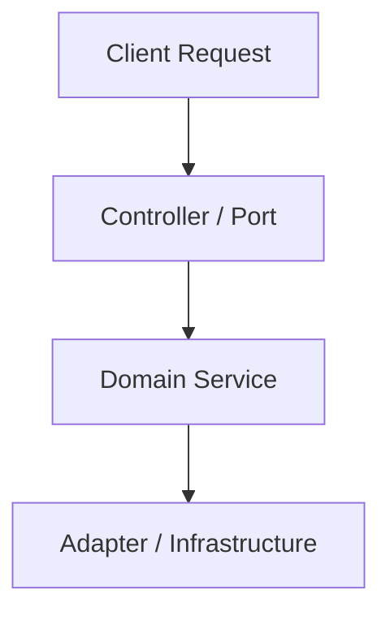

# RFC Template — Request for Comments

Before initiating any major architectural change or capability addition (particularly post-Version 4.0), engineering proposals must undergo a structured Request for Comments (RFC) review process to preserve system coherence, security, and performance.

---

## RFC Metadata
- **RFC Number**: `RFC-XXXX`
- **Title**: `[Short descriptive title of the proposal]`
- **Author(s)**: `[Name / Role]`
- **Status**: `Draft | Under Review | Approved | Rejected | Implemented`
- **Created Date**: `YYYY-MM-DD`
- **Target Release**: `vX.Y.Z`

---

## 1. Problem Statement
Describe the exact technical or product problem this proposal solves. What are the current limitations, friction points, or architectural bottlenecks?

## 2. Motivation
Why is it important to solve this problem *now*? What value does this provide to operational reliability, developer velocity, or end-user capability?

## 3. Alternatives Considered
Detail at least two alternative designs or approaches that were evaluated, explaining clearly why they were discarded (e.g., higher latency, operational complexity, tight coupling).

| Alternative Approach | Key Advantage | Primary Disadvantage | Reason for Discarding |
| :--- | :--- | :--- | :--- |
| *Alternative A* | ... | ... | ... |
| *Alternative B* | ... | ... | ... |

## 4. Proposed Architecture & Technical Design
Provide a detailed breakdown of the proposed technical architecture:
- **Hexagonal Boundary Impact**: Which Ports (`ports/`) and Adapters (`adapters/`) will be created or modified?
- **Data Flow & Sequence**: Step-by-step sequence of requests, events, and background worker interactions.
- **Data Model Changes**: New or modified MongoDB collections, indexes, or schemas (`Zod`).

## 5. Security & Compliance Analysis
- **Authentication & RBAC**: Does this change introduce new endpoints or permission tiers?
- **Input Validation & Sanitization**: How is malicious prompt injection or payload tampering mitigated (`aiLimiter`, `Zod`)?
- **Data Privacy**: Does this process or store sensitive user data or PII?

## 6. Performance Budget Impact
Evaluate how this proposal affects the established **Performance Budgets**:
- **Frontend Budgets**: Impact on bundle size (`KB`), initial render, or layout shifts.
- **Backend Budgets**: Estimated `P95` latency impact (`ms`), memory heap consumption, and database query complexity.
- **AI Budgets**: Estimated token footprint (`tokensIn/tokensOut`), cost impact (`$`), and RAG retrieval latency.

## 7. Migration Plan
- **Database Migrations**: Steps required to backfill or transform existing data.
- **Zero-Downtime Deployment**: How will this change be rolled out safely across staging and production clusters?

## 8. Rollback & Contingency Plan
- **Instant Rollback Trigger**: What exact threshold or failure state triggers an immediate rollback?
- **Reversion Script**: Exact command sequence (`scripts/rollback.sh <tag>`) and data cleanup procedures.

## 9. Approval & Sign-Off

| Stakeholder Role | Reviewer Name | Signature / Status | Date |
| :--- | :--- | :--- | :--- |
| **Lead Architect** | | `Pending` | |
| **Security Engineer** | | `Pending` | |
| **Operations Lead** | | `Pending` | |
